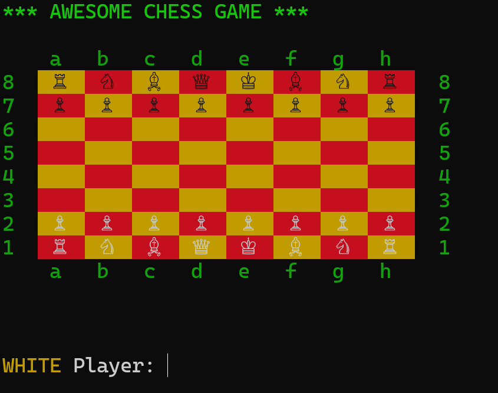

# Chess Game

A Ruby-based terminal chess game featuring a full implementation of standard chess rules and piece movements. This project includes player management, game state persistence, and colorful terminal output.



## Features

- Play new games or load saved games
- Standard chess pieces with movement and validation
- Colorful terminal display for board and pieces
- Automatic game saving on interruption

## Installation

Clone the repository and navigate to the project directory:

```sh
git clone git@github.com:andrecosta90/chess.git
cd chess
```

## Usage

Run the game with:
```sh
ruby lib/chess.rb
```
Follow the on-screen prompts to start a new game or load a saved game. Use terminal commands to make moves and view the game board.

## How to move?

+ Moving a rook from a1 to a5:
    + Command: a1a5
    + Explanation: The rook moves 4 rows up along the same column.
+ Moving a bishop from c1 to h6:
    + Command: c1h6
    + Explanation: The bishop moves diagonally 5 columns right and 5 rows up.
+ Moving a queen from d4 to g7:
    + Command: d4g7
    + Explanation: The queen moves diagonally 3 columns right and 3 rows up.
+ Moving a pawn from e2 to e4:
    + Command: e2e4
    + Explanation: The pawn moves 2 rows up in the same column.


## Testing

Run the game with:
```sh
rspec
```

## Upcoming Features

- **En Passant**: A special pawn capture move.
- **Castling**: A move involving the king and a rook.
- **Basic AI Computer Player**: A random-move AI opponent.
